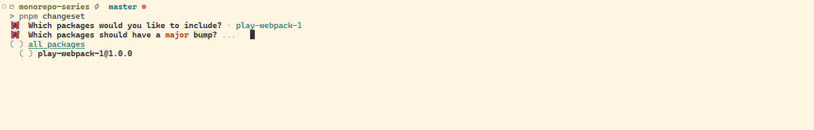
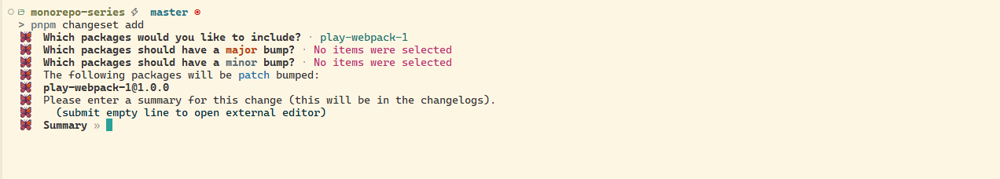
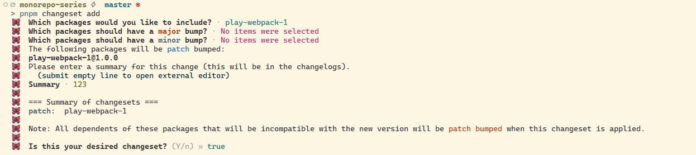

# Monorepo 架构

### 介绍

Monorepo是一种软件开发实践，其中所有的项目或库都托管在同一个Git仓库中，也就是**单体多模块仓库**。这种模式与传统的多个仓库（multirepo）模式相对。

1. 在Monorepo中，项目之间的依赖关系可以在一个仓库中更新，而不是在多个仓库中分别更新。
2. 所有的代码变更都在一个仓库中进行，这使得查看项目的整个变更历史变得更加容易。
3. 通过配置，可以减少工作空间中公用部分的依赖体积

### 参考

1. [你一定能学会Monorepo - 小野的web世界](https://www.bilibili.com/video/BV1TZz7YvEWZ/?spm_id_from=333.999.0.0&vd_source=1c6268f99220acd2592c93a3a87cbe31)

2. 和杜成讨论

3. 代码实践

### 使用pnpm搭建

1. 仓库初始化

   ```shell
   pnpm init # 或者 npm init -y
   ```

2. 配置工作区

   在仓库根目录创建一个`pnpm-workspace.yaml`文件作为工作区的配置文件，该文件按照yaml文件的语法编写，语法参考：

   下面是文件配置项：

   * `packages` 下来配置这个工作区范围包的相对路径，通常情况下，范围包会作为工作区的基本组成单元，**范围包**请参考：[scope](https://npm.nodejs.cn/cli/v11/using-npm/scope)，下面是一些示例：

     ```yaml
     packages:
       - a # 根目录下的文件夹 a 为一个范围包
       - "apps/*" # 根目录下的文件夹 apps 的下一级的所有目录都认为是一个范围包
       - packages/* # 根目录下的文件夹下 packages 的下一级所有目录都为一个范围包
       - "!**/test" # 排除根目录下所有的子目录（包含嵌套）test是一个范围包
       - "demo/**" # 根目录下的demo文件夹下所有的子目录都认为是一个范围包
       - server # 根目录下的文件夹server认为是一个范围包
     ```

   * `catalog`选项是用来定义一个默认目录来指定依赖的版本号（常量），目录中定义的常量可以在`package.json`中引用

     > catalog 来源于 **catalogs**，使用 (单数) catalog 字段创建名为 default 的目录
     >
     > 其 **catalogs** 是一个工作空间的功能，上面说的 catalog 是作为一个目录协议的

     在 pnpm-workspace.yaml 中定义目录

     ```yaml
     #.....
     
     # 定义目录和依赖版本号
     catalog:
       webpack: ^5.100.2
       webpack-cli: ^6.0.1
       postcss: ^8.5.6
       postcss-loader: ^8.1.1
       postcss-preset-env: ^10.1.5
       gasp: ^3.13.0
       sass: ^1.86.1
       sass-loader: ^16.0.5
     ```

     在该工作空间中的`package.json`可以使用`catalog:`协议来代替依赖版本

     ```json
     {
     	"name": "@test/example",
     	"dependencies": {
     		"webpack": "catalog:",
     		"webpack-cli": "catalog:"
     	}
     }
     ```

     也就等同于：

     ```json
     {
     	"name": "@test/example",
     	"dependencies": {
     		"webpack": "^5.100.2",
     		"webpack-cli": "^6.0.1"
     	}
     }
     ```

     你可以在 package.json 中的 dependencies，devDependencies，peerDependencies，optionalDependencies 中使用 catalog: 协议

     还可以在 pnpm-workspace.yaml 中的 overrides 中使用

   * `catalogs`选项是用来定义一个或者多个具名目录来指定依赖的版本号（常量），目录中定义的常量可以在`package.json`中引用

     > catalogs 选项也是 **catalogs** 功能的一部分，使用 (复数) catalogs 字段创建任意命名的目录。
     >
     > 这里的 catalogs 选项也是作为一个目录协议的

     与上面 catalog 类似，可以在 catalogs 选项下配置具有名称任意选择的多个 catalog。

     ```yaml
     catalogs:
       # 可以通过 "catalog:webpack5" 引用
       webpack5:
         webpack: ^5.100.2
         webpack-cli: ^6.0.1
         webpack-dev-server: ^5.2.2
       # # 可以通过 "catalog:utils" 引用
       utils:
       	es-toolkit: ^1.43.0
       	gsap: ^3.14.2
     ```

     catalog 选项可以与 catalogs 选项一起使用，这对正在更新依赖项版本的大型多包存储库可能会很有用。

     ```yaml
     catalog:
       typescript: ^5.9.3
     
     catalogs:
       # 可以通过 "catalog:webpack5" 引用
       webpack5:
         webpack: ^5.100.2
         webpack-cli: ^6.0.1
         webpack-dev-server: ^5.2.2
       # # 可以通过 "catalog:utils" 引用
       utils:
       	es-toolkit: ^1.43.0
       	gsap: ^3.14.2
     ```

   * `catalogMode`（pnpm>=10.12.1）

3. 安装依赖

   * `pnpm i`

     会安装工作空间内所有的依赖

   * `pnpm i -w`

     仅安装根目录的 package.json 的依赖

   * `pnpm i @<package_name>/<scope> -worskpace`

     安装工作区下的一个范围包依赖

   * `pnpm update`

     默认更新依赖版本。

     当 package.json 使用 catalog 目录协议时，pnpm-workspace.yaml 相关的 catalog 选项（单数和复数）会自动更新依赖版本号

     TODO: 添加一个操作过程的动图

     

4. 其他

   1. 过滤

      过滤允许你将命令限制于软件包的特定子集。

      pnpm 支持丰富的选择器语法，可以通过名称或关系选择包。

      可通过 `--filter` (或 `-F`) 标志指定选择器:

      ```shell
      pnpm --filter <package_selector> <command>
      ```

      详情请参考：[过滤](https://pnpm.io/zh/filtering)

### 扩展

#### 并行运行项目

为了方便运行多个项目的脚本（比如我想同时运行前端和node.js写的后端），可以安装`concurrently`，参考：[concurrently](https://github.com/open-cli-tools/concurrently?tab=readme-ov-file#usage)

**常用语法1**：

```shell
# 使用引号将单独的命令括起来，来并行运行两个命令
concurrently 'command1 arg' 'command2 arg'
```

可以用package.json来保存这个命令：

```json
{
	"scripts": {
		"start": "concurrently 'node ./index.js' 'node ./scripts.js'"
	}
}
```

其中`concurrently`可以简写为`conc`

```shell
# 使用引号将单独的命令括起来，来并行运行两个命令
conc 'command1 arg' 'command2 arg'
```

**常用语法2**：

可以通过`npm:`的语法来并行执行`package.json`中的命名

```json
{
	"scripts": {
		"index": "node ./index.js",
		"scripts": "node ./scripts.js",
		"start": "conc 'npm:index' 'npm:scripts'"
	}
}
```

然后运行`npm run start`，这里对`pnpm`一样适用。

当然`concurrently`还有很多api，可以在node.js中使用，但不属于本文章的范畴。

#### 管理版本和变更日志

为了方便管理版本（多包）和记录不同子包的变更日志，我们可以使用[changesets](https://github.com/changesets/changesets)

* 安装：

  ```shell
  # 项目内安装 changesets
  pnpm add -D -w @changesets/cli
  # 或者全局安装 changesets
  npm install -g @changesets/cli
  
  # 安装更改日志生成器包
  pnpm add -D -w @changesets/changelog-git
  ```

* 初始化

  ```shell
  changeset init
  ```

  他会生成一个.changeset文件夹，会包含changeset的配置文件`config.json`和发布版本前存储日志的文件`README.md`

  ```
  .changeset
  ├─ config.json # 配置文件
  └─ README.md
  ```

  `config.json`的配置请参考：[配置信息](https://github.com/changesets/changesets/blob/main/docs/config-file-options.md#access-restricted--public)

* 配置说明

  1. `access`

     如果你不打算发布私有包，可以将`access`写为`public`；如果打算发布私有包，可以将`access`写为`restricted`，并且需要登录到具有安装权限的npm帐户。

  2. `ignore`

     当我们使用changeset变更日志指定忽略的子包，它接收一个数组，每个数组元素都是忽略的子包的名称。

* 使用

  1. 变更日志

     可以使用命令：`npx changeset`或者`pnpm changeset`

     它会打开终端的交互式GUI，如：

     

     第一个步骤会让你选择添加变更日志的子包，上下箭头选择，空格键选取，enter键下一步。

     选取一个包后，下一步可以看到：

     

     它提示这个包是不是一个大的变更，其中`major`高亮。其实在语义化版本中：

     * Major

       Major版本号是语义化版本中的第一个数字，用于表示软件的主要版本变更。当进行大规模的、不兼容的变更时，应该增加Major版本号。

       主要变更包括：

       1. **不兼容的API更改**：当你修改了软件的API，以至于旧版本的代码无法与新版本一起正常工作时，应该升级Major版本号。这可能包括删除、更改或添加API端点、参数或行为。
       2. **重大功能新增**：如果你引入了重要的新功能，这可能会改变用户的工作流程或提供新的能力，也应该升级Major版本号。
       3. **废弃旧功能**：当你计划废弃或删除旧的功能时，通常需要增加Major版本号，以提醒用户进行迁移。

     * Minor

       Minor版本号是语义化版本中的第二个数字，用于表示向后兼容的新功能添加。

       Minor版本号的变更包括：

       1. **新增功能**：当你向软件添加新的功能，但这些功能不会破坏现有的API或功能，应该增加Minor版本号。
       2. **改进现有功能**：如果你对现有功能进行了改进，但这些改进不会导致现有用户的代码无法工作，也应该升级Minor版本号。
       3. **向后兼容的API增强**：如果你增加了现有API的参数、选项或能力，而这不会破坏已有的使用方式，也应该升级Minor版本号。

     * Patch

       Patch版本号是语义化版本中的第三个数字，用于表示向后兼容的错误修复或小的改进。

       Patch版本号的变更包括：

       1. **错误修复**：当你解决现有功能或API中的错误时，应该升级Patch版本号。这些修复不应引入新的功能或改变现有的行为。
       2. **性能优化**：如果你对现有功能进行性能优化，而不会改变其行为，也应该升级Patch版本号。
       3. **小的改进或修改**：如果你进行了一些小的改进，但它们不会破坏向后兼容性，应该升级Patch版本号。
     
      讲人话就是比如：当前npm包的版本为1.0.0，
     
     ​	如果你选择`major`，大版本会递增1，也就是2.0.0。
     
     ​	如果你选择`minor`，次要版本会递增1，也就是1.1.0。
     
     ​	如果你选择`patch`，修订版本会递增1，也就是1.0.1。
     
     继续上面的，如果什么都不选择，按enter键，他会从`major` => `minor` => `patch`，当到达`patch`时，会自动进入下一步：日志描述
     
     
     
     按回车键确认描述。
     
     
     
     最后一步，它会问你：Is this your desired changeset?
     
     也就是“这是你想要的改变吗？”，如果确定会进行下一步骤，如果取消那么上面的步骤作废。
     
  2. 
